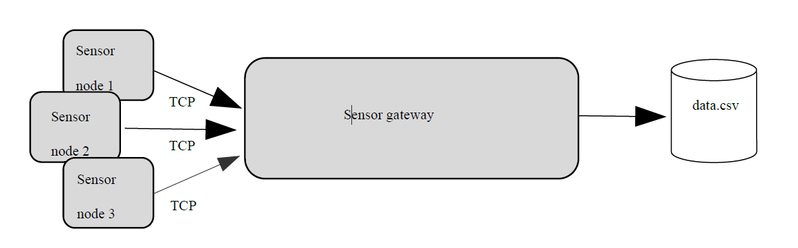
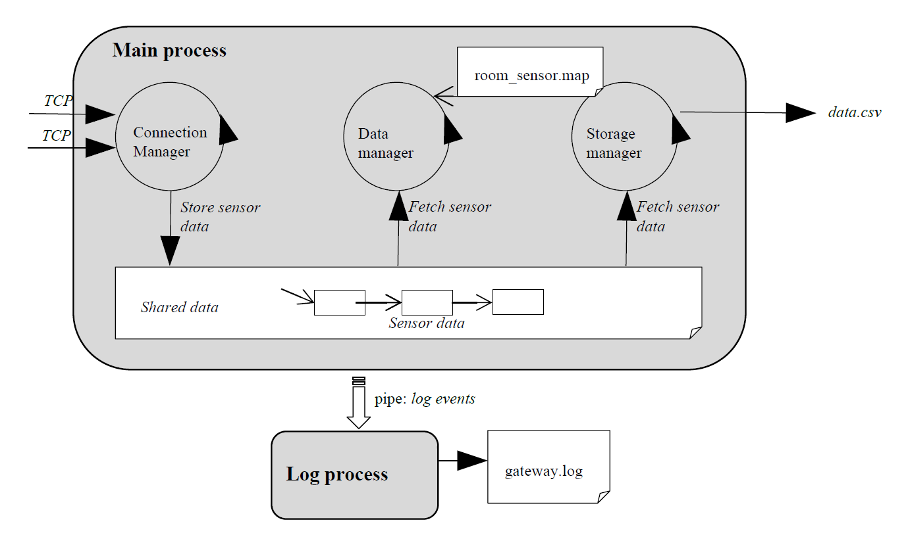

<!-- Disclaimer -->
This was created as final project for the Operating Systems course of Group T, KU Leuven

# Sensor Monitoring System
The sensor monitoring system consists of client-side sensor nodes measuring the room
temperature, and a central server-side sensor-gateway that acquires all sensor data from the
sensor nodes. A sensor node uses a TCP connection to transfer the sensor data to the sensor
gateway. The full system is depicted below.

## Sensor Gateway
A more detailed design of the sensor gateway is depicted below.

